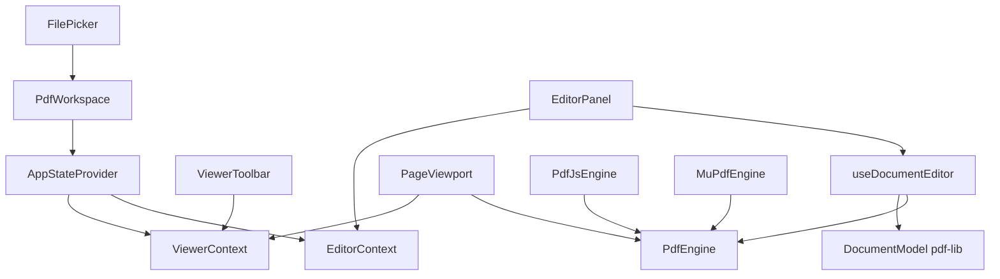

# PDF Viewer SDK — Architecture

This document describes the client-side architecture of the viewer: how UI, state, the rendering engine abstraction, and document editing fit together.

## High-level overview

The app is a Vite + React + TypeScript SPA. Users pick a PDF on an entry screen (`FilePicker`); the viewer (`PdfWorkspace`) loads bytes, holds a **`PdfEngine`** instance for rasterization, and a **`DocumentModel`** (pdf-lib) for structural edits. Rendering and editing use separate lifecycles: edits mutate bytes via `DocumentModel`, then the engine is reloaded from the new bytes so thumbnails and canvases stay consistent.

## Component diagram (dual engine paths)

The **`PdfEngine`** interface (see `../A/src/types/engine.ts`) isolates PDF.js and MuPDF behind one contract. Components do not import `pdfjs-dist` or MuPDF directly; they call methods on whichever adapter was constructed at load time. The diagram shows both paths from that interface.

At document load, the app chooses an adapter based on the user’s **engine preference** (PDF.js default, MuPDF for the WASM tier and bonus features). Both adapters implement the same `PdfEngine` surface: load PDF bytes or URL, query page dimensions, render a page to a canvas with `AbortSignal` support, and expose document bytes for syncing with `DocumentModel`.

## State management: Context and `useReducer`

Global application state lives in a **single** `useReducer` (`appReducer` + `AppState`), but it is **exposed through two React contexts** on purpose:

| Context | Roughly holds | Typical consumers |
|--------|----------------|-------------------|
| **ViewerContext** | Current engine, document model handle, page index, zoom, fit mode, scroll mode, loading progress, errors, viewer-only flags | Toolbar, `PageViewport`, print/save |
| **EditorContext** | Page list descriptors, selection, copy/paste buffer, editor thumbnail zoom, undo/redo stacks | `EditorPanel`, `EditorToolbar` |

**Why split contexts?** In continuous scroll mode, the current page can update frequently as the user scrolls. Putting that traffic in the same context as editor selection and undo stacks would force the editor UI to re-render on every scroll tick. Splitting subscriptions keeps scroll-driven updates cheap and localized to viewer components.

**Reducer rules:** `Set` and `Map` values in state are **replaced** on each update, never mutated in place, so `useReducer`’s reference equality triggers the right re-renders.

**Document editing** is not performed inside the reducer. The **`useDocumentEditor`** hook owns `DocumentModel` mutations, async save, engine reload, and undo snapshot management; it dispatches high-level results (e.g. pages replaced, engine swapped) back into the reducer.

## Key tradeoffs

### PDF.js vs MuPDF (dual engine)

| | PDF.js (`PdfJsEngine`) | MuPDF (`MuPdfEngine`, WASM) |
|---|------------------------|-----------------------------|
| **Bundle / load** | Worker + JS; smaller initial cost for the default path | Large WASM binary; loaded only when MuPDF is selected (dynamic import) |
| **Rendering** | Mature canvas rendering; great default viewer | Strong fit for advanced rasterization tied to the same engine as mutations |
| **COOP / COEP** | Works without cross-origin isolation | **Requires** `Cross-Origin-Opener-Policy` and `Cross-Origin-Embedder-Policy` for `SharedArrayBuffer` |
| **Bonus features** | Annotations / true redaction / bookmark write stay disabled in UI | Enables rectangle redaction with byte removal, click-to-place text annotations, bookmark read/write |

**Rationale:** PDF.js keeps the default experience fast to ship and small to load. MuPDF is optional and pays for WASM only when users opt in, while gating features that need deeper document access than the PDF.js path exposes in this project.

### Rendering vs editing separation

**PdfEngine** answers “what pixels go on the canvas?” **DocumentModel** answers “what is the next PDF file structure?” Mixing them (e.g. mutating the renderer’s internal document instead of pdf-lib bytes) would couple load order and make undo/redo and export unreliable. Reloading the engine from saved bytes after each edit is simpler and correct.

### Virtualized continuous scroll

Only pages near the viewport are rendered to canvas; others are placeholder blocks with correct height. This caps memory and CPU for long documents at the cost of more orchestration in `PageViewport`.

## If I had one more day

1. **Broader automated coverage** — Expand Playwright flows for local file open and print, and add visual or screenshot baselines for a couple of fixed sample PDFs so canvas regressions are caught beyond `toDataURL()` length checks.
2. **Keyboard and focus** — Audit tab order and shortcuts across toolbars and the editor grid so power users can work without excessive pointer travel.
3. **Performance pass** — Profile very large PDFs and tune render scheduling (e.g. debounce scroll-driven page index updates) if jank appears on low-end devices.
4. **Operational clarity** — Surface engine name and load errors in a compact debug strip (dev-only) to speed up support when COOP/COEP or WASM loading fails.
